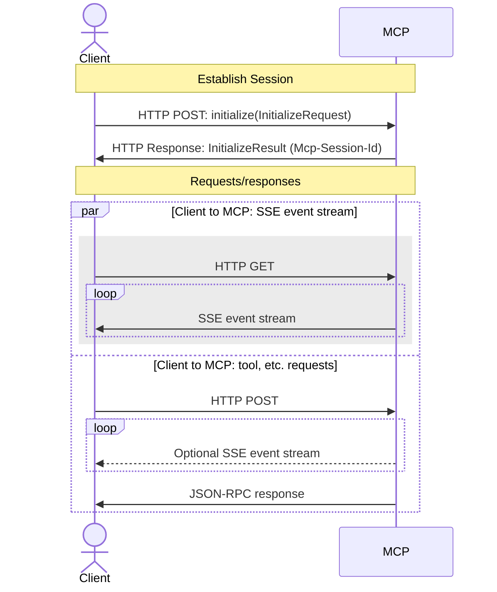
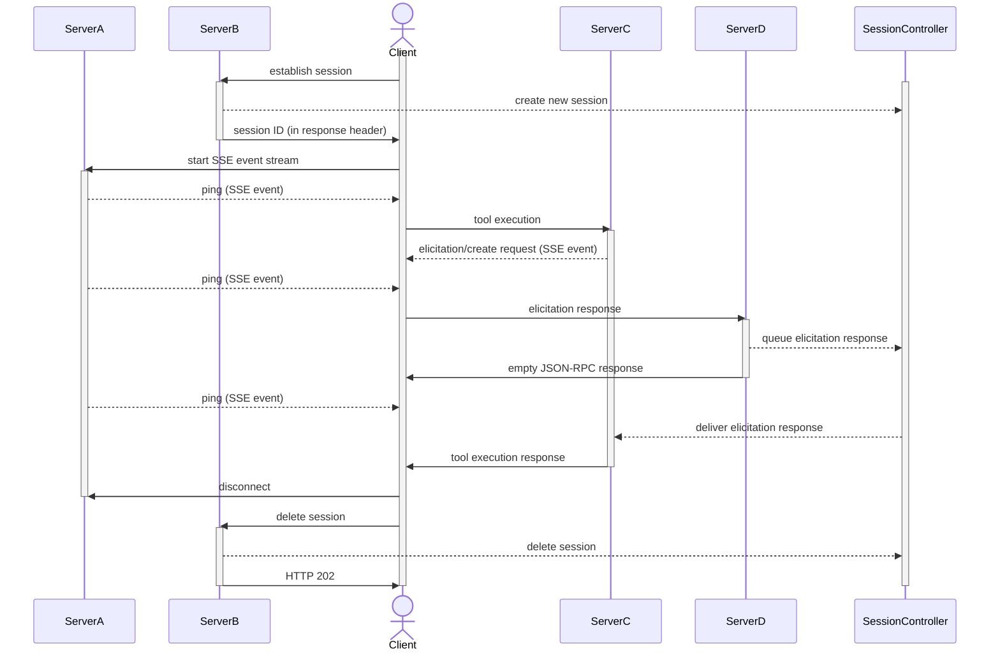

[◀︎ Airlift](../README.md) • [◀︎ MCP](README.md)

# MCP server support

## Sessions - technical details

### MCP protocol

Clients send MCP requests via standard HTTP POSTs. The server can respond with a single
JSON-RPC response or a Server-Sent Events (SSE) stream response. For SSE streams, the server
can send notifications and server-to-requests prior to sending the final JSON-RPC response.
For server-to-client requests, the client will send the response via a separate standard HTTP POST.
The response is correlated with the request via the session ID and a unique JSON-RPC request ID.

Simultaneously, clients maintain a server-to-client connection using an HTTP GET that expects an
SSE stream response. This SSE event stream contains server-to-client notifications. The main purpose
of this connection is to manage the session lifetime. The server sends periodic pings to the
client. This allows the client to determine if the session is still active and allows the server
to determine if the client is still connected. This connection is also used to notify the client
of any tool, prompt, or resource list changes.

### Session initiation

Clients establishes sessions with MCP servers by:

1. Sending an `initialize` message with an `InitializeRequest` to the server via HTTP POST
2. The server returns an `InitializeResult` as the response with the `Mcp-Session-Id` response header set to the session ID
3. The client opens an HTTP GET connection to the server with the `Mcp-Session-Id` request header set to the session ID to receive server-to-client messages via SSE
4. The client sends responses to tool, prompt, resource, and completion server-to-client requests via HTTP POST with the `Mcp-Session-Id` header set to the session ID

### Server-to-client request/response loops

Server-to-client requests are tied to active sessions and must be sent in the context of processing an MCP server tool, prompt, resource, or completion request.

Example of the server requesting an elicitation from the client:

1. Client sends a tool execution request via HTTP POST to the server 
2. Server sends an `elicitation/create` message with an `ElicitRequest`
3. Server waits for the client to respond
4. The client gets user input and sends the user's response to the server via a new HTTP POST with an `ElicitResult` as a JSON-RPC response with the request ID from the original request 
5. The server resumes processing the original tool execution request with the elicitation response 
6. The server sends the tool execution response to the client

It's important to notice that each of these steps is disconnected in time and potentially occur on
different servers. i.e. in a horizontally scaled topology, the tool execution request may be handled by
one server and the elicitation response may be handled by a different server, etc.

## Session management in Airlift MCP

The Airlift MCP module provides support for managing MCP sessions via the `McpSessionController` class. The default implementation, `MemorySessionController`, 
stores session state in memory. For production deployments, a distributed session manager should be implemented to support horizontal scaling and failover.

List updates, resource subscriptions, server-to-client requests, etc. are handled by "values" associated with a session. An `McpSessionController` is a distributed hash map.

### Handling tool, prompt, and resource list changes

When the client connects to the server for the HTTP GET SSE event loop (see [Session initiation](#session-initiation) above), the server the client
is connected to saves the current versions (a `UUID`) of the tool, prompt, and resource lists. Whenever any server adds a tool, prompt or resource, 
its version is changed _in every active session_. The server in the SSE event loop will see that the version has changed and can send a list update notification to the client.

See: 
- [McpValueKey.java](src/main/java/io/airlift/mcp/session/McpValueKey.java)
  - `TOOLS_LIST_VERSION`
  - `PROMPTS_LIST_VERSION`
  - `RESOURCES_LIST_VERSION`
- [SessionHandlerAndTransport.java](src/main/java/io/airlift/mcp/reference/SessionHandlerAndTransport.java)
  - `handleGetRequest()`
  - `updateListsAndSubscriptions()`
- [ReferenceServer.java](src/main/java/io/airlift/mcp/reference/ReferenceServer.java)
  - `postChangedEvent()`

### Resource subscriptions

When a client subscribes to a resource, the server handling the subscription gets the current version
of the resource via the `RESOURCE_VERSION` key (suffixed with the resource URI) and saves it as the subscription version
for the session via the `RESOURCE_SUBSCRIPTION` key. Whenever `notifyResourceChanged()` is called on any server
the `RESOURCE_VERSION` for that resource is changed _in every active session_. The server in the SSE event loop
checks for `RESOURCE_SUBSCRIPTION` values that do not match their corresponding `RESOURCE_VERSION` values
and sends resource update notifications to the client for those resources.

See:
- [McpValueKey.java](src/main/java/io/airlift/mcp/session/McpValueKey.java)
  - `RESOURCE_SUBSCRIPTION`
  - `RESOURCE_VERSION`
- [SessionHandlerAndTransport.java](src/main/java/io/airlift/mcp/reference/SessionHandlerAndTransport.java)
  - `handleResourcesUnsubscribe()`
  - `handleResourcesSubscribe()`
  - `updateListsAndSubscriptions()`
- [ReferenceServer.java](src/main/java/io/airlift/mcp/reference/ReferenceServer.java)
  - `notifyResourceChanged()`

### Server-to-client requests

When a tool, prompt, resource, or completion sends a server-to-client request, the following steps are taken:

- a random unique request ID is generated
- the server-to-client request is sent to the client via the current SSE event stream
- the client will send a separate HTTP POST with the response, using the same request/session ID
  - whatever server handles this response POST will save the response in the session via a `RESPONSE` value suffixed with the request ID
  - the payload of this key is the JSON-RPC response from the client
- the server handling the original request blocks until the session controller notes that a `RESPONSE` suffixed with the request ID is available
- the server receives the JSON-RPC response, continues processing, and sends the final response to the client

See:
- [McpValueKey.java](src/main/java/io/airlift/mcp/session/McpValueKey.java)
  - `RESPONSE`
- [McpSessionController.java](src/main/java/io/airlift/mcp/session/McpSessionController.java)
  - `waitValueCondition()`
- [SessionHandlerAndTransport.java](src/main/java/io/airlift/mcp/reference/SessionHandlerAndTransport.java)
  - `handleStandardRequest()`
- [ReferenceRequestContext.java](src/main/java/io/airlift/mcp/reference/ReferenceRequestContext.java)
  - `serverToClientRequest()`
