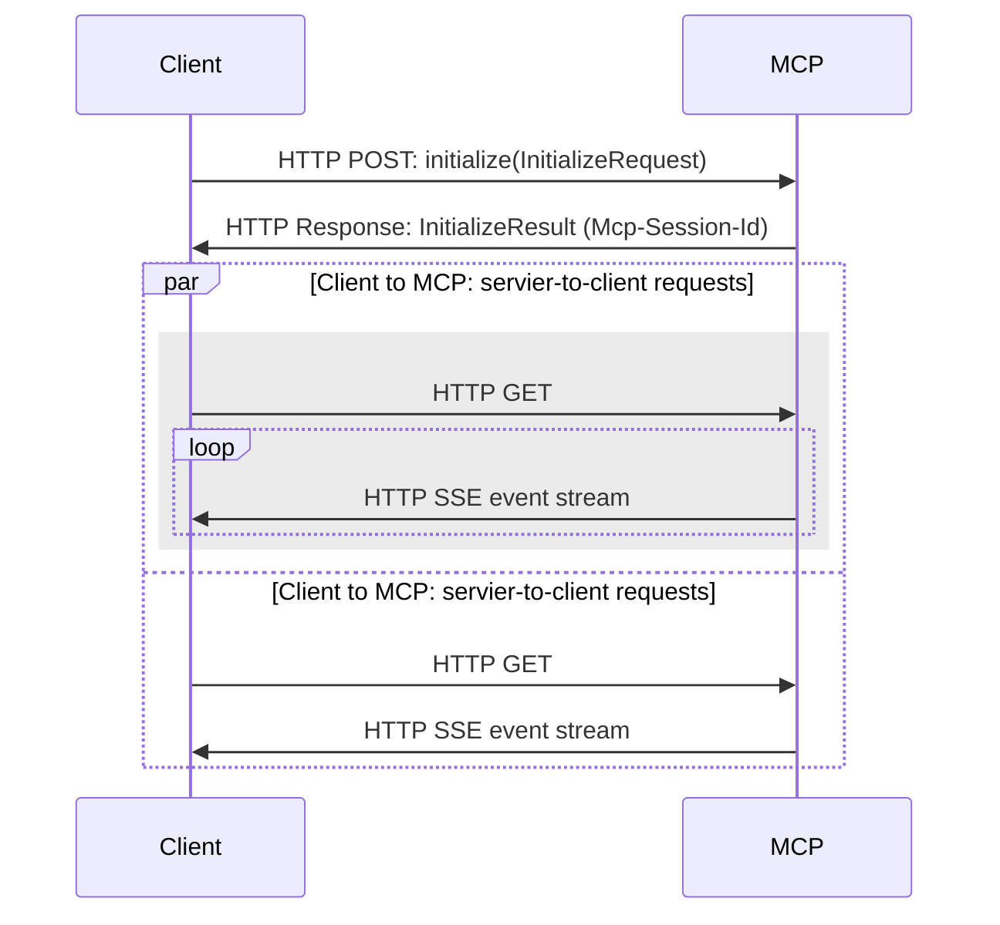
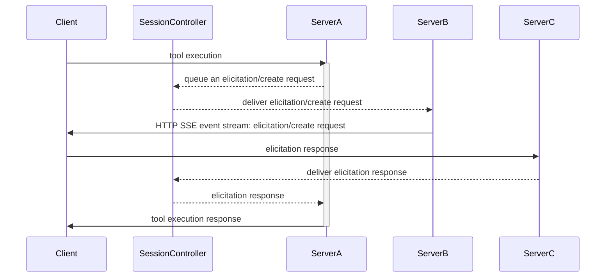

[◀︎ Airlift](../README.md) • [◀︎ MCP](README.md)

# MCP server support

## Sessions - technical details

### Session initiation

Clients send normal MCP requests via standard HTTP Posts. Simultaneously, clients maintain a
server-to-client connection using a HTTP GET that expects a Server-Sent Events (SSE) stream response.

The SSE event stream contains server-to-client notifications and requests. For a server-to-client
request, the client will send the response via a standard HTTP POST. The response is correlated
with the request via the session ID and a unique JSON-RPC request ID.

Client establishes sessions with MCP servers by:

1. Sending an `initialize` message with a `InitializeRequest` to the server via HTTP POST
2. The server returns a `InitializeResult` as the response with the `Mcp-Session-Id` response header set to the session ID
3. The client opens a HTTP GET connection to the server with the `Mcp-Session-Id` request header set to the session ID to receive server-to-client messages via SSE

```mermaid
sequenceDiagram
    participant Client
    participant MCP

    Client->>MCP: HTTP POST: initialize(InitializeRequest)
    MCP->>Client: HTTP Response: InitializeResult (Mcp-Session-Id)
    par Client to MCP: servier-to-client requests
        rect rgb(235, 235, 235)
            Client->>MCP: HTTP GET
            loop
                MCP->>Client: HTTP SSE event stream
            end
        end
    and Client to MCP: servier-to-client requests
        Client->>MCP: HTTP GET
        MCP->>Client: HTTP SSE event stream
    end
```

### Server-to-client request/response loops

Server-to-client requests are tied to active sessions and must be sent in the context of a processing an MCP server tool, prompt, resource, or completion request.

Example of the server requesting an elicitation from the client:

1. Client sends a tool execution request via HTTP POST to the server 
2. Server queues an `elicitation/create` message with an `ElicitRequest`
3. Server waits for the client to respond 
4. The SSE event stream delivers the `elicitation/create` request to the client 
5. Client notifies the end user to respond 
6. The client sends the user's response to the server via new HTTP POST with an `ElicitResult` as a JSON-RPC response with the request ID copied from the original request
7. The server resumes processing the original tool execution request with the elicitation response

It's important to notice that each of these steps is disconnected in time and potentially occur on three
different servers. i.e. in a horizontally scaled topology, the tool execution request may be handled by
one server, the SSE event stream may be handled by a second server, and the elicitation response may be handled by a third server.

## Session management in Airlift MCP

The Airlift MCP module provides support for managing MCP sessions via the `McpSessionController` class. The default implementation, `MemorySessionController`, 
stores session state in memory. For production deployments, a distributed session manager should be implemented to support horizontal scaling and failover.
See [distributed sessions](distributed-sessions.md) for details on how to create one.

Assuming a `McpSessionController` implementation that supports distributed sessions, Airlift manages sessions as follows:

### Event loop

When the client establishes the SSE event stream, the server instances handling the event stream polls for new events from the `McpSessionController` and returns them
to the client as SSE events. All server-to-client notifications and requests are sent via this event stream.

```mermaid
sequenceDiagram
    participant Client
    participant SessionController
    participant ServerA
    participant ServerB
    participant ServerC
    
    Client->>ServerA: tool execution
    activate ServerA
    ServerA-->>SessionController: queue an elicitation/create request
    SessionController-->>ServerB: deliver elicitation/create request
    ServerB->>Client: HTTP SSE event stream: elicitation/create request
    Client->>ServerC: elicitation response
    ServerC-->>SessionController: deliver elicitation response
    SessionController-->>ServerA: elicitation response
    ServerA->>Client: tool execution response
    deactivate ServerA
```
