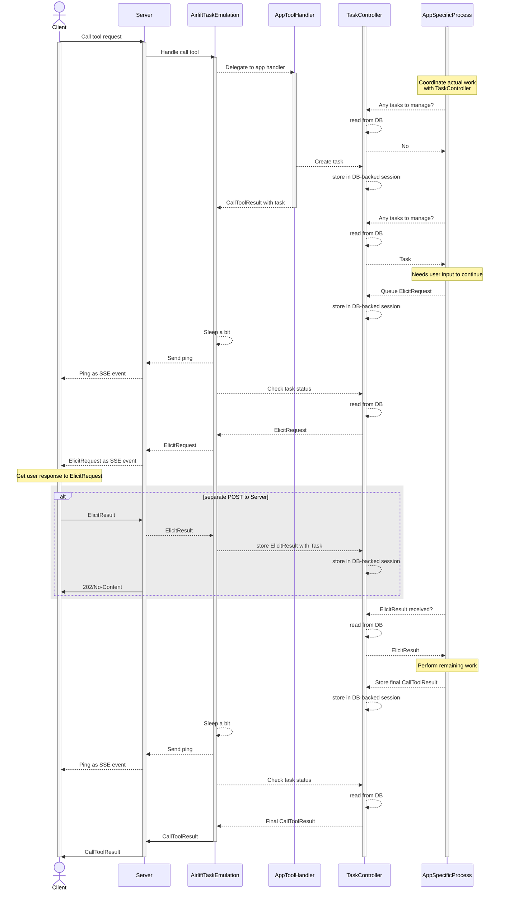
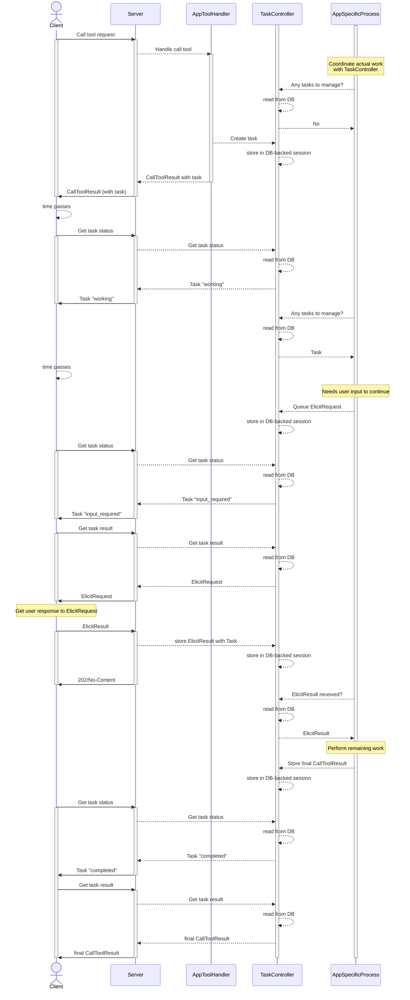

[◀︎ Airlift](../README.md) • [◀︎ MCP server support](README.md)

# MCP server support

## Tasks

The draft MCP spec adds [support for tasks](https://modelcontextprotocol.io/specification/2025-11-25/basic/utilities/tasks):

> Tasks are durable state machines that carry information about the underlying execution state of the request they wrap,
> and are intended for requestor polling and deferred result retrieval.

To enable task support use the `withTasks()` method of the `McpModule` to bind an implementation of
[TaskController](src/main/java/io/airlift/mcp/tasks/TaskController.java). A production-ready implementation
backed by [MCP sessions](README.md#sessions) is provided, assuming that your `SessionController` implementation is production-ready.
See: [SessionTaskController](src/main/java/io/airlift/mcp/tasks/session/SessionTaskController.java).

### Emulated Task Support

Tasks are new to the MCP spec, and it will take time for clients to support it. Airlift includes a server-side
emulation of MCP server tasks. This allows an MCP server to support tasks even when the client does not.
Once clients and reference implementations have caught up with the spec, task support can be determined when
the client connects. If the client supports tasks natively, the emulation can be bypassed.

The emulated task support takes advantage of [MCP session support in Airlift](README.md#sessions).

Here is a sequence diagram showing how an emulated tasks that requires an Elicitation from the user would work:

1. Client makes a call tool request
2. Server delegates to the task emulation
3. Task emulation forwards to the real app tool handler
4. The real app tool handler creates and returns an MCP Task
5. The app-provided task processing system polls the TaskController to check for tasks to manage
    - When the new task is found, it performs any initial work
    - When it needs user input to continue, it queues an ElicitRequest with the TaskController
5. Task emulation enters a blocking loop that:
   - periodically sends pings to the client as SSE events
   - checks the task status from the TaskController
   - the queued ElicitRequest is received from the TaskController and sent to the client as an SSE event
6. When the client sends the ElicitResult to the server, the server delegates it to the task emulation which stores it with the task
7. App-provided task processing polls the TaskController and receives the ElicitResult
    - It performs the remaining work 
    - Stores the final CallToolResult with the TaskController
8. Task emulation receives the final CallToolResult from the TaskController
9. Task emulation returns the final CallToolResult to the server and exits its loop
10. Server returns the final CallToolResult to the client

### Native Task Support

For native task support, the sequence is similar to [emulated task support](#emulated-task-support), but without the emulated blocking loop in the server.

1. Client makes a call tool request
2. Server delegates to the app tool handler
3. The app tool handler creates and returns an MCP Task and returns a CallToolResult with the task to the server
4. The server returns the CallToolResult with the task to the client
5. The app-provided task processing system polls the TaskController to check for tasks to manage
    - When the new task is found, it performs any initial work
    - When it needs user input to continue, it queues an ElicitRequest with the TaskController
6. The client periodically calls the server to get task status
    - The server returns, first, "working"
    - then, "input_required" when the ElicitRequest is queued
7. When the client receives the status of "input_required", it requests the task result
8. The server, via the TaskController, retrieves the ElicitRequest which is returned to the client
9. When the client sends the ElicitResult to the server, the server delegates  stores it with the task via the TaskController
10. App-provided task processing polls the TaskController and receives the ElicitResult
    - It performs the remaining work
    - Stores the final CallToolResult with the TaskController
11. The client continues to periodically calls the server to get task status until "completed" is returned
12. When the client receives the status of "completed", it requests the task result
13. Server returns the final CallToolResult to the client

