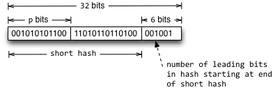

# HyperLogLog

# Glossary

* index bits: part of the hash used to represent the bucket index
* value bits: part of the hash used to compute the number of leading 0s
* `p`: Number of bits needed to represent bucket indexes
* `v`: Number of leading 0s 
* long hash: topmost 64 bits of the original hash
* short hash: topmost 26 bits of the original hash

## Hash function

* Murmur3-128
* Bucket index computed from the topmost `p` bits of the 128-bit hash

* To hash single byte, short, int, long, convert to little-endian byte representation
* To hash float or double, convert to 4 or 8-byte IEEE-754 representation

## Format

### Notes

* Unless otherwise noted, all values are little-endian.
* The following format specification is suitable for `p <= 16` (i.e., 65536 buckets).
* The old sparse layout (format tag = 0) is no longer supported due to unacceptable
  error rates that compounded when building many independent sparse instances and merging them.

### Sparse layout

* entries are sorted in increasing order by bucket index, no duplicate bucket indexes

##### Entry layout

### Dense layout

Bucket value are stored as deltas from a baseline value, which is computed as:

`baseline = min(buckets)`

The buckets values are encoded as a sequence of 4-bit values:

Based on the statistical properties of the HLL algorithm, 4-bits should be sufficient to encode
the majority of the values in a given HLL structure. In the unlikely case that a bucket overflows,
the remainder is stored in an overflow entry. Only the highest overflow is kept around.

