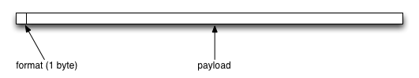

# HyperLogLog

# Glossary

* index bits: part of the hash used to represent the bucket index
* value bits: part of the hash used to compute the number of leading 0s
* `p`: Number of bits needed to represent bucket indexes
* `v`: Number of leading 0s 
* long hash: topmost 64 bits of the original hash
* short hash: topmost 26 bits of the original hash

## Hash function

* Murmur3-128
* Bucket index computed from the topmost `p` bits of the 128-bit hash

* To hash single byte, short, int, long, convert to little-endian byte representation
* To hash float or double, convert to 4 or 8-byte IEEE-754 representation

## Format

### Notes

* Unless otherwise noted, all values are little-endian.
* The following format specification is suitable for `p <= 16` (i.e., 65536 buckets).
* The old sparse (format tag = 0) and dense (format tag = 1) layouts are no longer supported
  due to unacceptable error rates that compounded when building many independent instances and
  merging them.

### Sparse layout

* entries are sorted in increasing order by bucket index, no duplicate bucket indexes

##### Entry layout

### Dense layout (v2)

Bucket values are stored as deltas from a baseline value, which is computed as:

`baseline = min(buckets)`

The buckets values are encoded as a sequence of 4-bit values:

Based on the statistical properties of the HLL algorithm, 4-bits is sufficient to encode
the majority of the values in a given HLL structure. For deltas bigger than 2^4, the remainders
are stored in a list of overflow entries.

#### Dense v1

The old dense format is documented here for completeness. Implementations are encouraged to accept
this format when deserializing an HLL structure, but to operate with and serialize using version 2.

