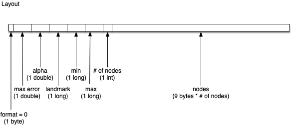
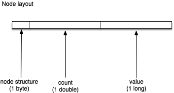
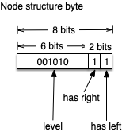

# Quantile Digest

## Background

The implementation of quantile digest in this library is based on 
[q-digest [Shrivastava et al. ’04]](http://citeseerx.ist.psu.edu/viewdoc/summary?doi=10.1.1.132.7343).
It has been modified to support exponential decay based on 
[Cormode et al. ’09](http://citeseerx.ist.psu.edu/viewdoc/summary?doi=10.1.1.159.3978).

## Format

_Unless otherwise noted, all values are little-endian._

### Quantile Digest Layout

The quantile digest algorithm uses a binary tree to store discrete ranges of values
and their cardinality.  In this format, the nodes that make up the quantile digest's 
binary tree are serialized as a post-order traversal of the tree.

* format: byte value which represents the format used for serialization (currently
just one format exists, `0`)
* max error: represents the maximum error as a double
* alpha: represents the exponential decay factor as a double
* landmark: represents the seconds from epoch time used by the quantile
digest's exponential decay algorithm as a long
* min: the minimum value seen represented as a long, used to improve the 
error on low quantile queries
* max: the maximum value seen represented as a long, used to improve the 
error on high quantile queries
* \# of nodes: the number of nodes in this quantile digest represented as an int
* nodes: the post-order traversed sequence of nodes in the binary tree which
represents the quantile digest

#### Node layout

Each node in the binary tree consists of:

* node structure: byte value that contains information related to the node's placement
in the binary tree, including the level and left/right child presence
* count: the number of values for the current node represented as a double
* value: the long value that this node represents.  For nodes which are not at level
0 this represents a range of values.

#### Node structure layout

The node structure is compressed and consists of three parts.  See diagram
for their representation in binary.

* level: the level on the binary tree for the current node.  Given that the maximum
height of the tree will only ever be 64, this number is decremented by 1 for
non-leaf nodes to reduce the range to `[0, 64)` (which can be represented in
exactly 6 bits).
* right child presence
* left child presence
